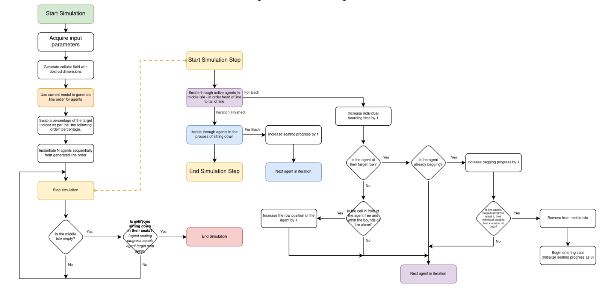

# Modelling of aeroplane boarding & disembarking using cellular automata
### 2022 IM²C Team "High Distinction" Entry

This repository contains the program for the cellular automaton used in our partial solution to the 2022 IMMC problem.

## Notes

This is published as an educational source only. You may read the report included inside of the repository, which contains a statistical analysis of the data produced by the tool.

Due to time constraints during the competition, we were unable to create a disembarking model, hence its abscence from the code here.

## Read the Report
You can get the submitted report PDF [here](HighDistinction_IMMC_Entry.pdf).
